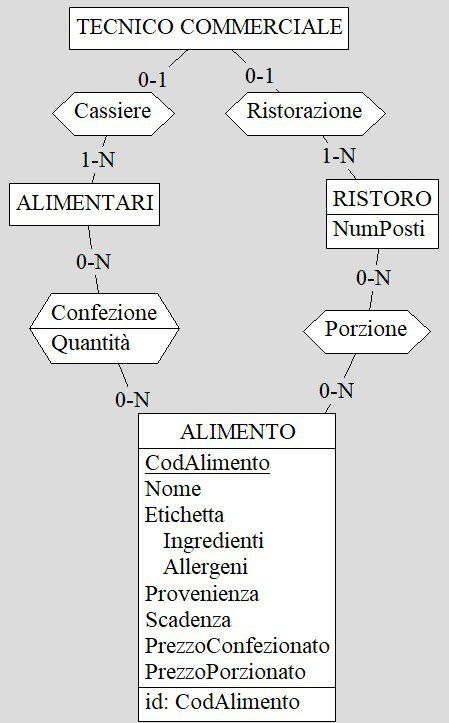
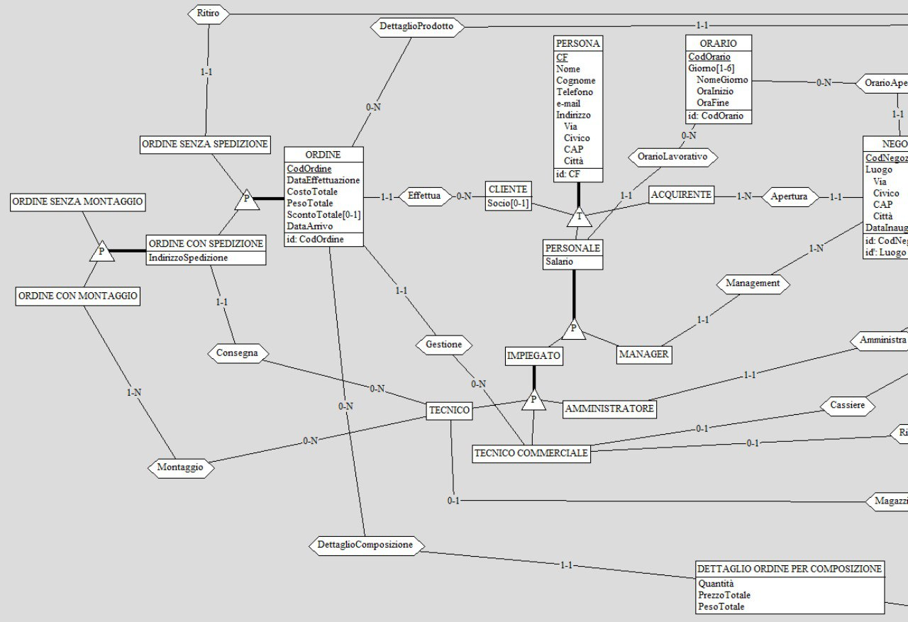

<div>
<h1 style="text-align: center">Elaborato per il corso</h1>
<h1 style="text-align: center">di basi di dati</h1>
<h3 style="text-align: center">2021/2022</h3>
<br><br>
<h1 style="text-align: center">MiKasa</h1>
<br><br>
</div>


### Componenti

Salvatore Antonio Addimando, matricola : 0000970539<br>
Benedetta Pacilli, matricola: 0000975296<br>
Valentina Pieri, matricola: 0000974789

<div style="page-break-after: always;"></div>

# Indice
- [Indice](#indice)
- [Capitolo 1 - Analisi dei requisiti](#capitolo-1---analisi-dei-requisiti)
  - [Intervista](#intervista)
  - [Estrazione dei concetti principali](#estrazione-dei-concetti-principali)
- [Capitolo 2 - Progettazione concettuale](#capitolo-2---progettazione-concettuale)
  - [Schema scheletro](#schema-scheletro)
  - [Schema concettuale finale](#schema-concettuale-finale)
- [Capitolo 3 - Progettazione logica](#capitolo-3---progettazione-logica)
  - [Stima del volume dei dati](#stima-del-volume-dei-dati)
  - [Descrizione delle operazioni principali e stima della loro frequenza](#descrizione-delle-operazioni-principali-e-stima-della-loro-frequenza)
  - [Schemi di navigazione e tabelle degli accessi](#schemi-di-navigazione-e-tabelle-degli-accessi)
  - [Raffinamento dello schema](#raffinamento-dello-schema)
  - [Analisi delle ridondanze](#analisi-delle-ridondanze)
  - [Traduzione di entità e associazioni in relazioni](#traduzione-di-entità-e-associazioni-in-relazioni)
  - [Schema relazionale finale](#schema-relazionale-finale)
  - [Traduzione delle operazioni in query SQL](#traduzione-delle-operazioni-in-query-sql)
- [Capitolo 4 - Progettazione dell'applicazione](#capitolo-4---progettazione-dell-'-applicazione)

<div style="page-break-after: always;"></div>

# Capitolo 1 - Analisi dei requisiti

## Intervista

Si vuole tenere traccia di una catena di negozi simil-Ikea.
Per ogni negozio si tiene traccia del luogo e della data di inaugurazione, dell'orario di apertura e del suo codice negozio.
Ogni negozio viene suddiviso in zone, ognuna con un suo codice zona. Vi sono 4 tipi di zone: shop alimentari, ristoro, esposizione e magazzino.
La zona delle esposizioni è formata da tante composizioni di mobili, come ad esempio: cucina, bagno, ufficio, camera da letto, ecc...
Per ogni composizione viene salvato il nome, il numero di prodotti al suo interno e il suo codice composizione.
Una composizione è formata da più prodotti e ogni prodotto appartiene ad una sola composizione. Per ogni prodotto vengono salvati: il nome, il prezzo, le dimensioni, il peso e il codice prodotto. Ci sono 3 tipi di prodotti: i mobili, gli accessori e gli elettrodomestici.
Ad ogni prodotto viene inoltre associato uno o più colori e ogni colore può essere di più prodotti. Per ogni colore vengono salvati il nome e il codice colore.
Per i prodotti si mantiene uno storico sconti: a ogni prodotto possono essere applicati più sconti in base al periodo dell'anno. Il periodo di validità di uno sconto viene mantenuto tramite lo storico sconti. Ogni sconto può essere applicato a più prodotti. Per lo sconto vengono salvati una percentuale conto e un codice sconto, mentre, per lo storico sconti vengono salvati il periodo di sconto e il codice dello storico.
Tutti i prodotti vengono stoccati nei magazzini dei vari negozi. In ogni magazzino ci sono da zero a N prodotti e, allo stesso tempo, ogni prodotto può essere presente in uno, nessuno o tanti magazzini. Per lo stoccaggio dei prodotti vengono salvati la locazione del prodotto nel magazzino e la quantità di prodotto presente.
Per quanto riguarda lo shop alimentari e la zona di ristoro, questi vendono diversi alimenti. La zona ristoro vende gli alimenti al dettaglio mentre, la zona dello shop li vende all'ingrosso. Per entrambe le vendite vengono mantenuti i prezzi, al pezzo da una parte e all'ingrosso dall'altra. Inoltre, nella vendita all'ingrosso viene mantenuto il numero di pezzi venduti per ogni prodotto. Per i vari alimenti vengono salvati: il nome, gli ingredienti con i relativi allergeni, la provenienza, la scadenza e il codice a barre.
In questo database vi sono anche diversi tipi di persone. Per ogni persona vengono salvati: il nome, il cognome, il numero di telefono, l'indirizzo email, l'indirizzo e il codice fiscale. Ci sono 3 tipi di persone: clienti, personale e acquirenti. Ogni acquirente può aprire diversi negozi della catena mentre, ogni negozio ha un solo acquirente.
Per il personale vengono salvati: il salario, l'orario lavorativo e il codice personale. Il personale si divide tra impiegati e manager.
Ogni manager si occupa di un solo negozio e ogni negozio ha un solo manager.
Ci sono diversi tipi di impiegati: i tecnici, i tecnici commerciali e gli amministratori. Ogni amministratore gestisce una sola zona di un negozio mentre, ogni zona può avere più amministratori.
Ogni tecnico commerciale può occuparsi: di uno o nessuno shop, di uno o nessun alimentari, di zero/N ordini. Per quanto riguarda l'alimentari e il ristoro, questi possono avere da 1 a N tecnici commerciali mentre, ogni ordine è gestito da un solo tecnico commerciale.
Gli ordini vengono effettuati dai clienti: ogni cliente può fare più ordini e ogni ordine è relativo ad un solo cliente. Il singolo ordine è formato da zero/N dettagli ordine per prodotto/composizione. Un dettaglio ordine tiene conto della quantità acquistata di ogni singolo/a prodotto/composizione ordinato/a. Oltre alla quantità, un dettaglio ordine mantiene il prezzo totale per quel/la prodotto/composizione. Per ogni ordine vengono mantenuti: la data di effettuazione, il costo totale, il peso totale, lo sconto totale dell'ordine, la data di arrivo e il codice ordine. Un cliente può essere socio o meno; in caso sia socio ha diritto ad uno sconto sull'ordine totale. Gli ordini si dividono in due categorie: con e senza spedizione. Di un ordine spedizione si può fare il ritiro in un solo negozio, in ogni negozio vengono spediti più ordini. Per la spedizione, di un ordine con spedizione, viene mantenuto l'indirizzo di spedizione e il codice spedizione. Ogni spedizione viene consegnata da uno o più tecnici e ogni tecnico si può occupare di zero/N spedizioni.
Per un ordine con spedizione si può richiedere il montaggio. L'assemblaggio viene gestito da uno o più tecnici e ogni tecnico può occuparsi di zero/N assemblaggi. Infine, un tecnico può lavorare o meno come magazziniere nel magazzino di un negozio, ogni magazzino ha uno o più tecnici che vi lavorano.

## Estrazione dei concetti principali

| Termine             | Descrizione                                                                                                                                                                                                                                                                                                                                                                                                                                                                                                                                    | Eventuali Sinonimi |
| ------------------- | ---------------------------------------------------------------------------------------------------------------------------------------------------------------------------------------------------------------------------------------------------------------------------------------------------------------------------------------------------------------------------------------------------------------------------------------------------------------------------------------------------------------------------------------------- | ------------------ |
| Negozio             | Un negozio della catena                                                                                                                                                                                                                                                                                                                                                                                                                                                                                                                        |                    |
| Zona                | Ogni negozio viene diviso in zone                                                                                                                                                                                                                                                                                                                                                                                                                                                                                                              |                    |
| Acquirente          | Colui che acquista e apre un negozio                                                                                                                                                                                                                                                                                                                                                                                                                                                                                                           |                    |
| Cliente             | Colui che effettua acquisti in un negozio creando ordini                                                                                                                                                                                                                                                                                                                                                                                                                                                                                       |                    |
| Manager             | Colui che gestisce un negozio                                                                                                                                                                                                                                                                                                                                                                                                                                                                                                                  |                    |
| Amministratore      | Colui che si occupa di una zona di un negozio                                                                                                                                                                                                                                                                                                                                                                                                                                                                                                  |                    |
| Tecnico commerciale | Colui che gestisce o la zona ristoro o lo shop alimentari (di un determinato negozio) o gli ordini                                                                                                                                                                                                                                                                                                                                                                                                                                             |                    |
| Tecnico             | Colui che si occupa o del magazzino di un negozio o delle spedizioni o degli assemblaggi                                                                                                                                                                                                                                                                                                                                                                                                                                                       |                    |
| Shop alimentari     | La zona di un negozio dove vengono venduti gli alimenti all'ingrosso                                                                                                                                                                                                                                                                                                                                                                                                                                                                           | Alimentari         | 
| Ristoro             | La zona di un negozio dove vengono venduti gli alimenti al dettaglio                                                                                                                                                                                                                                                                                                                                                                                                                                                                           | Punto ristoro      |
| Alimento            | Venduto in ogni shop alimentari e in ogni punto ristoro                                                                                                                                                                                                                                                                                                                                                                                                                                                                                        |                    |
| Magazzino           | La zona di un negozio dove vengono stoccati i prodotti                                                                                                                                                                                                                                                                                                                                                                                                                                                                                         |                    |
| Esposizione         | La zona di un negozio in cui vi sono le varie composizione                                                                                                                                                                                                                                                                                                                                                                                                                                                                                     |                    |
| Composizione        | Una composizione è formata da tanti prodotti. Ogni composizione mostra in modo visivamente gradevole un insieme di prodotti relativi ad una determinata zona della casa (bagno, camera da letto, cucina, ...). Ogni composizione può essere interamente acquistata da un cliente                                                                                                                                                                                                                                                               |                    |
| Prodotto            | Venduto da ogni negozio, può essere acquistato dal cliente. Ogni prodotto può essere diversamente scontato in base al periodo dell'anno                                                                                                                                                                                                                                                                                                                                                                                                        |                    |
| Ordine              | Ogni ordine viene effettuato da un cliente. L'ordine è formato da tanti dettagli ordine, specifici o per un prodotto o per una composizione. In caso il cliente che effettua l'ordine, sia socio, viene applicato uno sconto totale sull'ordine. Ogni ordine può essere richiesto con o senza spedizione: un ordine senza spedizione verrà spedito ad un negozio scelto dal cliente mentre, un ordine con spedizione viene spedito all'indirizzo del cliente. Inoltre, per ogni ordine con spedizione può essere richiesto o meno il montaggio |                    |

Onde evitare ambiguità il punto ristoro verrà nominato esclusivamente come ristoro e lo shop alimentari varrà nominato come alimentari.

# Capitolo 2 - Progettazione concettuale

## Schema scheletro 

Per lo sviluppo dello schema ER generale si procede suddividendolo in  schemi ER più piccoli che modellano i singoli concetti di MiKasa.

### Persona

Per modellare i vari ruoli presenti nel database si parte da un'entità padre: **Persona**. Persona racchiude tutti i campi necessari al modellamento di **Cliente**, **Acquirente** e **Personale**. L'entità Personale modella un generico membro del corpo lavorativo di MiKasa e si divide in **Impiegato** e **Manager**. Infine, l'entità Impiegato è stata divisa nelle tre categorie; **Tecnico**, **Tecnico Commerciale** e **Amministratore**.
La gerarchia Persona-Cliente-Personale-Acquirente è totale ma non esclusiva; è infatti possibile, ad esempio, che una stessa persona possa sia essere un cliente che un membro del personale. Entrambe le gerarchie Personale-Impiegato-Manager e Impiegato-Tecnico-Tecnico Commerciale-Amministratore sono sia totale che esclusive.


### Cliente-Ordine

Una relazione fondamentale è quella del **Cliente** che effettua un **Ordine**. 
Ogni cliente può effettuare tutti gli ordini che vuole. Per ogni ordine è fondamentale calcolare il suo peso e costo totale, ottenuti dai dati dei singoli prodotti acquistati. Per il prezzo totale è importante controllare che il cliente sia socio o meno, da socio infatti si ha diritto ha uno sconto sul prezzo totale dell'ordine.
Il cliente può anche scegliere se far spedire l'ordine al suo indirizzo o ad un negozio MiKasa dove si recherà il cliente stesso per ritirarlo. In caso di ordine con spedizione si hanno due ulteriori scelte: ordine senza montaggio e ordine con montaggio, in quest'ultimo l'assemblaggio dei mobili viene eseguito da un tecnico del personale.


### Personale-Ordine

L'altra importante relazione in cui c'è **Ordine** è quella tra gli ordini e il **Personale**.  
I tecnici commerciali gestiscono gli ordini: mettono insieme i vari articoli ordinati, stabiliscono la data di arrivo, gestiscono i soldi in entrata. Invece, di spedizione e montaggio se ne occupano i tecnici. 


### Negozio-Zona

Ogni **Negozio** della catena viene aperto da un **Acquirente** e gestito da un **Manager**. 
Ogni negozio è suddiviso in 4 zone: **Alimentari**, **Ristoro**, **Esposizione** e **Magazzino**.
 
 
 
 ### Orario
 
 L'entità **orario** viene utilizzata per definire l'orario lavorativo dei membri del personale e l'orario di apertura dei negozi. Ogni orario che viene creato può essere usato da più membri del personale/negozi.
 
  
 
### Alimentari-Ristoro

 Sia nella zona **alimentari** che nella zona **ristoro** vengono venduti degli **alimenti**, nel primo si vendono in confezioni contenenti diverse unità di quell'alimento, nel secondo, essendo una zona bar/bistrot, ogni alimento è venduto singolarmente. 
 
 
 
 ###  Prodotto-Composizione
 
 La zona **esposizioni** di ogni negozio è formata da tante **composizioni** di mobili. Questa zona è pensata per mostrare al cliente, non solo ogni singolo prodotto venduto (in quanto non ci sono prodotti non esposti), ma anche per creare composizioni che siano esteticamente belle e funzionali. Tra le composizioni proposte ci sono infatti diverse proposte di cucina, salotto, bagno, ufficio, camera da letto, ecc...
 
  
 
 ### Prodotto-Magazzino
  
  In ogni **Negozio** vi è un **Magazzino**; quest'ultimo può contenere o meno tutti i prodotti oppure essere addirittura vuoto.  Ogni **Prodotto** venduto nei negozi della catena infatti, si potrebbe trovare in ogni magazzino, in solo alcuni magazzini (quindi è presente in solo alcuni negozi) o anche in nessuno magazzino se la sua disponibilità è terminata ovunque. 
  In ogni magazzino ci lavorano alcuni tecnici detti magazzinieri.
  
   
 
 ### Prodotto
 
 I **prodotti** venduti in ogni negozio sono divisi in tre categorie (mobili, accessori, elettrodomestici) tramite una gerarchia totale ed esclusiva. 
 Ogni prodotto può avere uno o più **colori** e può essere scontato o meno.
 Il sistema degli **sconti** viene gestito mediante uno **storico sconti** che, per ogni sconto, mantiene il suo periodo di validità annuale.
 Ogni prodotto può avere uno, nessuno o molti sconti; in quanto questi hanno tutti diversi periodi di validità
  
   
  
   ### Dettaglio Ordine

Ogni **Ordine** è formato da più dettagli ordine. Ci sono due tipi di dettaglio ordine: **Dettaglio Ordine per Prodotto** e **Dettaglio Ordine per Composizione**.  
Ogni dettaglio ordine per prodotto mantiene i dati per un solo prodotto acquistato: quanti pezzi sono stati acquistati di quel prodotto e il costo totale per quel prodotto (ottenuto moltiplicando il prezzo, già scontato se ha uno sconto applicato valido nel periodo di effettuazione dell'ordine, del singolo prodotto per la quantità).
Lo stesso meccanismo vale per il dettaglio prodotto per composizione.


<div style="page-break-after: always;"></div>

## Schema concettuale finale



<div style="page-break-after: always;"></div>


<div style="page-break-after: always;"></div>

# Capitolo 3 - Progettazione logica

## Stima del volume dei dati

| Concetto                          | Costrutto | Volume         |
| --------------------------------- | --------- | -------------- |
| Persona                           | E         | 20,003,200     |
| Cliente                           | E         | 20,000,000     |
| Personale                         | E         | 3,100          |
| Acquirente                        | E         | 100            |
| Impiegato                         | E         | 3,000          |
| Manager                           | E         | 100            |
| Tecnico                           | E         | 1,000          |
| Amministratore                    | E         | 1,000          |
| Tecnico Commerciale               | E         | 1,000          |
| Negozio                           | E         | 100            |
| Orario                            | E         | 10             |
| Zona                              | E         | 400            |
| Alimentari                        | E         | 100            |
| Ristoro                           | E         | 100            |
| Esposizione                       | E         | 100            |
| Magazzino                         | E         | 100            |
| Alimento                          | E         | 1,000          |
| Prodotto                          | E         | 10,000         |
| Mobile                            | E         | 4,000          |
| Elettrodomestico                  | E         | 4,000          |
| Accessorio                        | E         | 2,000          |
| Colore                            | E         | 50             |
| Sconto                            | E         | 10             |
| Storico sconti                    | E         | 10             |
| Composizione                      | E         | 10             |
| Dettaglio Ordine per Prodotto     | E         | 50,000,000,000 |
| Dettaglio Ordine per Composizione | E         | 50,000,000,000 |
| Ordine                            | E         | 1,000,000,000  |
| Ordine senza Spedizione           | E         | 300,000,000    |
| Ordine con Spedizione             | E         | 700,000,000    |
| Ordine senza Montaggio            | E         | 350,000,000    |
| Ordine con Montaggio              | E         | 350,000,000    |
| Effettua                          | R         | 1,000,000,000  |
| Ritiro                            | R         | 300,000,000    |
| Consegna                          | R         | 700,000,000    |
| Montaggio                         | R         | 350,000,000    |
| Dettaglio Prodotto                | R         | 50,000,000,000 |
| Dettaglio Composizione            | R         | 50,000,000,000 |
| Riferimento Prodotto              | R         | 50,000,000,000 |
| Riferimento Composizione          | R         | 50,000,000,000 |
| Gestione                          | R         | 1,000,000,000  |
| Orario Lavorativo                 | R         | 3,100          |
| Orario Apertura                   | R         | 100            |
| Apertura                          | R         | 100            |
| Management                        | R         | 100            |
| Amministra                        | R         | 400            |
| Suddivisione                      | R         | 400            |
| Cassiere                          | R         | 100            |
| Ristorazione                      | R         | 100            |
| Magazziniere                      | R         | 100            |
| Confezione                        | R         | 50,000         |
| Porzione                          | R         | 10,000         |
| Esposta                           | R         | 1,000          |
| Composta                          | R         | 1,000          |
| Colorazione                       | R         | 500,000        |
| Applicato                         | R         | 10,000         |
| Storico                           | R         | 10             |

<div style="page-break-after: always;"></div>

## Descrizione delle operazioni principali e stima della loro frequenza
Di seguito vengono riportate le frequenze delle varie operazioni effettuabili.

| Codice | Operazione                                                                 | Frequenza       |
| ------ | -------------------------------------------------------------------------- | --------------- |
| 1      | Aggiungere un nuovo cliente                                                | 1 a settimana   |
| 2      | Iscrizione di un cliente per divenire socio                                | 100 al mese     |
| 3      | Aggiungere un nuovo manager                                                | 10 all'anno     |
| 4      | Aggiungere un nuovo negozio alla catena                                    | 1 ogni due anni |
| 5      | Effettuazione di un ordine da parte di un cliente                          | 1 all'anno      |
| 6      | Aggiungere un nuovo prodotto                                               | 10 all'anno     |
| 7      | Aggiungere un nuovo alimento                                               | 10 all'anno     |
| 8      | Aggiungere una nuova composizione                                          | 10 all'anno     |
| 9      | Aggiungere un nuovo sconto                                                 | 1 all'anno      |
| 10     | Leggere tutti gli ordini effettuati in un determinato mese                 | 1 al mese       |
| 11     | Leggere tutti gli ordini effettuati da un cliente                          | 1 al mese       |
| 12     | Leggere tutte le spedizioni effettuate in un determinato mese              | 1 al mese       |
| 13     | Leggere tutti i ritiri effettuati in un determinato mese                   | 1 al mese       |
| 14     | Leggere tutti i montaggi effettuati in un determinato mese                 | 1 al mese       |
| 15     | Leggere i prodotti più acquistati                                          | 2 all'anno      |
| 16     | Leggere i prodotti meno acquistati                                         | 2 all'anno      |
| 17     | Leggere i prodotti più costosi                                             | 1 all'anno      |
| 18     | Leggere i prodotti meno costosi                                            | 1 all'anno      |
| 19     | Leggere gli alimenti porzionati più costosi                                | 1 all'anno      |
| 20     | Leggere gli alimenti confezionati più costosi                              | 1 all'anno      |
| 21     | Leggere la quantità presente(in ogni magazzino) di un determinato prodotto | 1 al giorno     |
| 22     | Leggere tutti i prodotti terminati nei vari magazzini                      | 1 al giorno     |
| 23     | Leggere tutti i membri del personale                                       | 1 al mese       |
| 24     | Leggere i prodotti con lo sconto maggiore                                  | 2 all'anno      |
| 25     | Leggere tutti gli ordini effettuati dopo una certa data                    | 1 all'anno      |
| 26     | Leggere gli ordini più costosi                                             | 1 all'anno      |
| 27     | Leggere gli ordine più costosi effettuati da un determinato cliente        | 1 all'anno      |
| 28     | Leggere tutti i clienti                                                    | 10 al giorno    |
| 29     | Disiscrizione di un cliente socio                                          | 10 al mese      |
| 30     | Aggiungere un orario                                                       | 5 all'anno      |
| 31     | Restock di un prodotto nel magazzino di un negozio                         | 100 a settimana |
| 32     | Aggiungere una nuova confezione                                            | 2 all'anno      |
| 33     | Aggiungere una nuova porzione                                              | 2 all'anno      |
| 34     | Esporre una composizione nella zona esposizioni di un negozio              | 2 all'anno      |
| 35     | Aggiungere un nuovo colore                                                 | 1 all'anno      |
| 36     | Aggiungere una nuova colorazione per un determinato prodotto               | 10 all'anno     |
| 37     | Aggiungere un nuovo amministratore                                         | 10 all'anno     |
| 38     | Aggiungere un nuovo tecnico                                                | 10 all'anno     |
| 39     | Aggiungere un nuovo tecnico commerciale                                    | 10 all'anno     |
| 40     | Licenziare dei membri del personale                                        | 5 all'anno      |
| 41     | Leggere gli alimenti porzionati meno costosi                               | 1 all'anno      |
| 42     | Leggere gli alimenti confezionati meno costosi                             | 1 all'anno      |
| 43     | Aggiungere un nuovo storico sconto                                         | 1 ogni due anni |
| 44     | Aggiungere un nuovo acquirente                                             | 1 ogni due anni | 

<div style="page-break-after: always;"></div>

## Schemi di navigazione e tabelle degli accessi
Le tabelle che seguono mostrano gli accessi di tutte le operazioni effettuabili

### OP1: Aggiungere un nuovo cliente
| Concetto | Costrutto | Accessi | Tipo |
| -------- | --------- | ------- | ---- |
| Cliente  | E         | 1       | S    |
#### Totale: 1S -> 1 a settimana

### OP2: Iscrizione di un cliente per divenire socio
| Concetto | Costrutto | Accessi | Tipo |
| -------- | --------- | ------- | ---- |
| Cliente  | E         | 1       | L    |
| Cliente  | E         | 1       | S    | 
#### Totale: 1L, 1S -> 200 al mese

### OP3: Aggiungere un nuovo manager
| Concetto  | Costrutto | Accessi | Tipo |
| --------- | --------- | ------- | ---- |
| Negozio   | E         | 1       | L    |
| Manager   | E         | 1       | S    |
#### Totale: 1L, 1S -> 20 all'anno

### OP4: Aggiungere un nuovo negozio alla catena
| Concetto        | Costrutto | Accessi | Tipo |
| --------------- | --------- | ------- | ---- |
| Acquirente      | E         | 1       | L    |
| Negozio         | E         | 1       | S    |
| Apertura        | R         | 1       | S    |
| Orario Apertura | R         | 1       | S    |
 #### Totale: 1L, 3S -> 4 ogni due anni

### OP5: Effettuazione di un ordine da parte di un cliente
| Concetto                          | Costrutto | Accessi                                                                                | Tipo |
| --------------------------------- | --------- | -------------------------------------------------------------------------------------- | ---- |
| Cliente                           | E         | 2                                                                                      | L    |
| Prodotto                          | E         | 1 + 2\*numero di composizioni acquistate                                               | L    |
| Composizione                      | E         | 1                                                                                      | L    |
| Negozio                           | E         | 1                                                                                      | L    |
| Sconto                            | E         | 2\*numero di prodotti acquistati + 2\*numero di prodotti delle composizioni acquistate | L    |
| Storico Sconto                    | E         | numero di prodotti acquistati + numero di prodotti delle composizioni acquistate       | L    |
| Tecnici Commerciali               | E         | 1                                                                                      | L    |
| Ordine                            | E         | 1                                                                                      | S    |
| Dettaglio Ordine per Prodotto     | E         | numero di prodotti acquistati                                                          | S    |
| Dettaglio Ordine per Composizione | E         | numero di composizioni acquistate                                                      | S    |
| Tecnico                           | E         | 0/1                                                                                    | L    |
| Ordine con Spedizione             | E         | 0/1                                                                                    | S    |
| Ordine con Montaggio              | E         | 0/1                                                                                    | S    |
| Applicato                         | R         | numero di prodotti acquistati + numero di prodotti delle composizioni acquistate       | L    |
| Storico                           | R         | numero di prodotti acquistati + numero di prodotti delle composizioni acquistate       | L    |
| Composta                          | R         | 2\*numero di composizioni acquistate                                                   | L    |
| Effettua                          | R         | 1                                                                                      | S    |
| Gestione                          | R         | 1                                                                                      | S    |
| Consegna                          | R         | 0/1                                                                                    | S    |
| Montaggio                         | R         | 0/1                                                                                    | S    |
| Dettaglio Prodotto                | R         | numero di prodotti acquistati                                                          | S    |
| Riferimento prodotto              | R         | numero di prodotti acquistati                                                          | S    |
| Dettaglio Composizione            | R         | numero di composizioni acquistate                                                      | S    |
| Riferimento Composizione          | R         | numero di composizioni acquistate                                                      | S    |
| Ordine senza Spedizione           | E         | 0/1                                                                                    | S    | 
#### Totale: (6/7 + 4\*numero di composizioni acquistate + 5\*numero di prodotti acquistati + 5\*numero di prodotti delle composizioni acquistate)L, (3/8 + 3\*numero di prodotti acquistati + 3\*numero di composizioni acquistate)S -> (9/15 + 7\*numero di composizioni acquistate + 8\*numero di prodotti acquistati + 5\*numero di prodotti delle composizioni acquistate)all'anno

Schema di navigazione


### OP6: Aggiungere un nuovo prodotto
| Concetto  | Costrutto | Accessi | Tipo |
| --------- | --------- | ------- | ---- |
| Sconto    | E         | 1       | L    |
| Prodotto  | E         | 1       | S    |
| Applicato | R         | 1       | S    |
#### Totale: 1L, 2S -> 30 all'anno

### OP7: Aggiungere un nuovo alimento
| Concetto | Costrutto | Accessi | Tipo |
| -------- | --------- | ------- | ---- |
| Alimento | E         | 1       | S    | 
#### Totale: 1S -> 10 all'anno

### OP8: Aggiungere una nuova composizione
| Concetto     | Costrutto | Accessi                                     | Tipo |
| ------------ | --------- | ------------------------------------------- | ---- |
| Prodotto     | E         | 1                                           | L    |
| Composizione | E         | 1                                           | S    |
| Composta     | R         | numero di prodotti nella nuova composizione | S    |
#### Totale: 1L, (2+numero di prodotti nella nuova composizione)S -> (3 + numero di prodotti nella nuova composizione)\*10 all'anno

### OP9: Aggiungere un nuovo sconto
| Concetto       | Costrutto | Accessi | Tipo |
| -------------- | --------- | ------- | ---- |
| Storico Sconti | E         | 1       | L    |
| Sconto         | E         | 1       | S    |
| Storico        | R         | 1       | L    | 
#### Totale: 2L, 1S -> 3 all'anno

### OP10: Leggere tutti gli ordini effettuati in un determinato mese 
| Concetto | Costrutto | Accessi | Tipo |
| -------- | --------- | ------- | ---- |
| Ordine   | E         | 1       | L    |
#### Totale: 1L -> 1 al mese

### OP11: Leggere tutti gli ordini effettuati da un cliente
| Concetto | Costrutto | Accessi | Tipo |
| -------- | --------- | ------- | ---- |
| Ordine   | E         | 1       | L    |
| Cliente  | E         | 1       | L    |
| Effettua | E         | 1       | L    | 
#### Totale: 3L -> 3 al mese

### OP12: Leggere tutte le spedizioni effettuate in un determinato mese 
| Concetto   | Costrutto | Accessi | Tipo |
| ---------- | --------- | ------- | ---- |
| Spedizione | E         | 1       | L    |
| Ordine     | E         | 1       | L    |
#### Totale: 2L -> 2 al mese

### OP13: Leggere tutti i ritiri effettuati in un determinato mese  
| Concetto                | Costrutto | Accessi | Tipo |
| ----------------------- | --------- | ------- | ---- |
| Ordine senza Spedizione | E         | 1       | L    |
| Ordine                  | E         | 1       | L    |
#### Totale: 2L -> 2 al mese

### OP14: Leggere tutti i montaggi effettuati in un determinato mese 
| Concetto   | Costrutto | Accessi | Tipo |
| ---------- | --------- | ------- | ---- |
| Montaggio  | E         | 1       | L    |
| Spedizione | E         | 1       | L    |
| Ordine     | E         | 1       | L    |
#### Totale: 3L -> 3 al mese

### OP15: Leggere i prodotti più acquistati
| Concetto                      | Costrutto | Accessi | Tipo |
| ----------------------------- | --------- | ------- | ---- |
| Prodotto                      | E         | 1       | L    |
| Dettaglio Ordine per Prodotto | E         | 1       | L    |
| Riferimento Prodotto          | R         | 1       | L    | 
#### Totale: 3L -> 6 all'anno

### OP16: Leggere i prodotti meno acquistati
| Concetto                      | Costrutto | Accessi | Tipo |
| ----------------------------- | --------- | ------- | ---- |
| Prodotto                      | E         | 1       | L    |
| Dettaglio Ordine per Prodotto | E         | 1       | L    |
| Rfierimento Prodotto          | E         | 1       | L    | 
#### Totale: 3L -> 6 all'anno

### OP17: Leggere i prodotti più costosi 
| Concetto                      | Costrutto | Accessi | Tipo |
| ----------------------------- | --------- | ------- | ---- |
| Prodotto                      | E         | 1       | L    |
#### Totale: 1L -> 1 all'anno

### OP18: Leggere i prodotti meno costosi
| Concetto                      | Costrutto | Accessi | Tipo |
| ----------------------------- | --------- | ------- | ---- |
| Prodotto                      | E         | 1       | L    |
#### Totale: 1L -> 1 all'anno

### OP19: Leggere gli alimenti porzionati più costosi
| Concetto | Costrutto | Accessi | Tipo |
| -------- | --------- | ------- | ---- |
| Alimento | E         | 1       | L    |
#### Totale: 1L -> 1 all'anno

### OP20: Leggere gli alimenti confezionati più costosi
| Concetto | Costrutto | Accessi | Tipo |
| -------- | --------- | ------- | ---- |
| Alimento | E         | 1       | L    |
#### Totale: 1L -> 1 all'anno

### OP21: Leggere la quantità presente(in ogni magazzino) di un determinato prodotto
| Concetto   | Costrutto | Accessi | Tipo |
| ---------- | --------- | ------- | ---- |
| Prodotto   | E         | 2       | L    |
| Magazzino  | E         | 1       | L    |
| Stockaggio | R         | 1       | L    | 
#### Totale: 4L -> 4 al giorno

### OP22: Leggere tutti i prodotti terminati nei vari magazzini 
| Concetto   | Costrutto | Accessi | Tipo |
| ---------- | --------- | ------- | ---- |
| Prodotto   | E         | 1       | L    |
| Magazzino  | E         | 1       | L    | 
| Stockaggio | R         | 1       | L    |
#### Totale: 3L -> 3 al giorno

### OP23: Leggere tutti i membri del personale 
| Concetto            | Costrutto | Accessi | Tipo |
| ------------------- | --------- | ------- | ---- |
| Manager             | E         | 1       | L    |
| Amministratore      | E         | 1       | L    |
| Tecnico             | E         | 1       | L    |
| Tecnico Commerciale | E         | 1       | L    | 
#### Totale: 4L -> 4 al mese

### OP24: Leggere i prodotti con lo sconto maggiore
| Concetto  | Costrutto | Accessi | Tipo |
| --------- | --------- | ------- | ---- |
| Sconto    | E         | 1       | L    |
| Prodotto  | E         | 1       | L    |
| Applicato | R         | 1       | L    | 
#### Totale: 3L -> 6 all'anno

### OP25: Leggere tutti gli ordini effettuati dopo una certa data
| Concetto | Costrutto | Accessi | Tipo |
| -------- | --------- | ------- | ---- |
| Ordine   | E         | 1       | L    | 
#### Totale: 1L -> 1 all'anno

### OP26: Leggere gli ordini più costosi
| Concetto | Costrutto | Accessi | Tipo |
| -------- | --------- | ------- | ---- |
| Ordine   | E         | 1       | L    |
#### Totale: 1L -> 1 all'anno

### OP27: Leggere gli ordine più costosi effettuati da un determinato cliente
| Concetto | Costrutto | Accessi | Tipo |
| -------- | --------- | ------- | ---- |
| Ordine   | E         | 1       | L    |
| Cliente  | E         | 1       | L    |
| Effettua | R         | 1       | L    | 
#### Totale: 3L -> 3 all'anno

### OP28: Visualizzare tutti i clienti
| Concetto | Costrutto | Accessi | Tipo |
| -------- | --------- | ------- | ---- |
| Cliente  | E         | 1       | L    |
#### Totale: 1L -> 10 al giorno                                                            

### OP29: Disiscrizione di un cliente socio 
| Concetto | Costrutto | Accessi | Tipo |
| -------- | --------- | ------- | ---- |
| Persona  | E         | 1       | L    |
| Cliente  | E         | 1       | L    |
| Cliente  | E         | 1       | S    | 
#### Totale: 2L, 1S -> 30 al mese

### OP30: Aggiungere un orario 
| Concetto | Costrutto | Accessi | Tipo |
| -------- | --------- | ------- | ---- |
| Orario   | E         | 1       | S    | 
#### Totale: 5S -> 5 all'anno 

### OP31: Restock di un prodotto nel magazzino di un negozio
| Concetto | Costrutto | Accessi | Tipo |
| -------- | --------- | ------- | ---- |
| Negozio  | E         | 1       | L    |
| Prodotto | E         | 1       | L    |
| Magazzino  | E         | 1       | S    |
| Stockaggio | R         | 1       | S    | 
#### Totale: 2L, 2S -> 400 a settimana

### OP32: Aggiungere una nuova confezione
| Concetto   | Costrutto | Accessi | Tipo |
| ---------- | --------- | ------- | ---- |
| Negozio    | E         | 1       | L    | 
| Alimento   | E         | 1       | L    |
| Confezione | R         | 1       | S    |	
#### Totale: 2L, 1S -> 3 all'anno

### OP33: Aggiungere una nuova porzione
| Concetto | Costrutto | Accessi | Tipo |
| -------- | --------- | ------- | ---- |
| Negozio  | E         | 1       | L    |
| Alimento | E         | 1       | L    |
| Porzione | R         | 1       | S    |
#### Totale: 2L, 1S -> 3 all'anno

### OP34: Esporre una composizione nella zona esposizioni di un negozio
| Concetto     | Costrutto | Accessi | Tipo |
| ------------ | --------- | ------- | ---- |
| Negozio      | E         | 1       | L    |
| Composizione | E         | 1       | L    |
| Esposta      | R         | 1       | S    | 
#### Totale: 2L, 1S -> 6 all'anno

### OP35: Aggiungere un nuovo colore  
| Concetto | Costrutto | Accessi | Tipo |
| -------- | --------- | ------- | ---- |
| Colore   | E         | 1       | L    | 
| Colore   | E         | 1       | S    |
#### Totale: 1L, 1S -> 2 all'anno

### OP36: Aggiungere una nuova colorazione per un determinato prodotto 
| Concetto    | Costrutto | Accessi | Tipo |
| ----------- | --------- | ------- | ---- |
| Colore      | E         | 1       | L    |
| Prodotto    | E         | 1       | L    |
| Colorazione | R         | 1       | S    |
#### Totale: 2L, 1S -> 30 all'anno

## OP37 : Aggiungere un nuovo amministratore
| Concetto          | Costrutto | Accessi | Tipo |
| ----------------- | --------- | ------- | ---- |
| Negozio           | E         | 1       | L    |
| Amministratore    | E         | 1       | S    |
| Orario Lavorativo | R         | 1       | S    | 
#### Totale: 1L, 2S -> 30 all'anno

### OP38: Aggiungere un nuovo tecnico 
| Concetto          | Costrutto | Accessi | Tipo |
| ----------------- | --------- | ------- | ---- |
| Negozio           | E         | 1       | L    |
| Tecnico           | E         | 1       | S    |
| Orario Lavorativo | R         | 1       | S    |
#### Totale: 1L, 2S -> 30 all'anno

### OP39: Aggiungere un nuovo tecnico commerciale
| Concetto            | Costrutto | Accessi | Tipo |
| ------------------- | --------- | ------- | ---- |
| Negozio             | E         | 1       | L    |
| Tecnico Commerciale | E         | 1       | S    |
| Orario Lavorativo   | R         | 1       | S    |
#### Totale: 1L, 2S -> 30 all'anno

### OP40:  Licenziare dei membri del personale
| Concetto            | Costrutto | Accessi | Tipo |
| ------------------- | --------- | ------- | ---- |
| Manager             | E         | 1       | L    |
| Tecnico             | E         | 1       | L    |
| Tecnico Commerciale | E         | 1       | L    |
| Amministratore      | E         | 1       | L    |
| Manager             | E         | 0/1     | S    |
| Tecnico             | E         | 0/1     | S    |
| Tecnico Commerciale | E         | 0/1     | S    |
| Amministratore      | E         | 0/1     | S    |
#### Totale: 4L, 0-4S -> 20-40 all'anno

### OP41: Leggere gli alimenti porzionati meno costosi
| Concetto | Costrutto | Accessi | Tipo |
| -------- | --------- | ------- | ---- |
| Alimento | E         | 1       | L    |
#### Totale: 1L -> 1 all'anno

### OP42: Leggere gli alimenti confezionati meno costosi
| Concetto | Costrutto | Accessi | Tipo |
| -------- | --------- | ------- | ---- |
| Alimento | E         | 1       | L    |
#### Totale: 1L -> 1 all'anno

### OP43: Aggiungere un nuovo storico sconto
| Concetto       | Costrutto | Accessi | Tipo |
| -------------- | --------- | ------- | ---- |
| Storico Sconti | E         | 1       | S    | 
#### Totale: 1S -> 1 ogni due anni

### OP44: Aggiungere un nuovo acquirente
| Concetto   | Costrutto | Accessi | Tipo |
| ---------- | --------- | ------- | ---- |
| Acquirente | E         | 1       | S    | 

<div style="page-break-after: always;"></div>

## Raffinamento dello schema
### Eliminazione delle gerarchie
- Gerarchia Persona-Cliente-Personale-Acquirente: è stato utilizzato il collasso verso il basso, portando gli attributi di Persona in Cliente, in Personale e in Acquirente. In questa maniera la tabella Persona viene eliminata.
- Gerarchia Personale-Impiegato-Manager: è stato utilizzato il collasso verso il basso, portando gli attributi di Personale in Impiegato e in Manager. In questa maniera la tabella Personale viene eliminata.
- Gerarchia Impiegato-Tecnico-TecnicoCommerciale-Amministratore: è stato utilizzato il collasso verso il basso, portando gli attributi di Impiegato in Tecnico, in Tecnico Commerciale e in Amministartore. In questa maniera la tabella Impiegato viene eliminata.
- Gerarchia Prodotto-Mobile-Accessorio-Elettrodomestico: è stato utilizzato il collasso verso l'alto, aggiungendo il campo "tipo" alla tabella Prodotto. Per ogni prodotto aggiunto, il suo attributo "tipo" sarà uguale a 1 se si tratta di un mobile, uguale a 2 se si tratta di un accessorio e uguale a 3 se si tratta di un elettrodomestico. 
- Gerarchia Zona-Alimentari-Ristoro-Esposizione-Magazzino: è stato utilizzato il collasso verso l'alto portando i vari attributi di Alimentari, Ristoro, Esposizione e Magazzino in Zona; dopo di chè è stato fatto un accorpamento di entità da Zona verso Negozio. In questo modo i vari attributi di Alimentari, Ristoro, Esposizione e Magazzino vengono salvati in Negozio
- Gerarchia Ordine-OrdineNoSpedizione-OrdineSpedizione-OrdineNoMontaggio-OrdineMontaggio: nello schema logico è stata eliminata la tabella Ordine Senza Montaggio, mentre le tabelle Ordine con Montaggio, Ordine senza Spedizione e Ordine con Spedizione vengono rispettivamente rinominate in Montaggio, Ritiro e Spedizione. Per evitare ambiguità la precedente relazione Montaggio che lega Ordine con Montaggio e Tecnico viene rinominata in Dettaglio Montaggio. 

### Eliminazione degli attributi compositi
Ogni attributo composto presente è stato suddiviso nelle sue sotto-componenti. Gli attributi composti in questione sono: Indirizzo di Persona, Luogo di Negozio, Giorno di Orario, Etichetta di Alimento, Dimensioni di Prodotto e PeriodoSconto di Storico Sconti.

### Eliminazione degli identificatori esterni
Nello schema E/R sono eliminate le seguenti relazioni:
- Effettua: importando cf_cliente di Cliente in Ordine
- Consegna: importando cf_tecnico di Tecnico Spedizione
- Montaggio: reificata, importando codOrdine da Ordine con Montaggio e importando cf_tecnico da Tecnico; creando una nuova entità Dettaglio Montaggio
- Ritiro: importando codNegozio di Negozio in Ordine senza Spedizione (Ordine senza Spedizione diventa Ritiro nello schema logico).
- DettaglioProdotto: importando codOrdine di Ordine in Dettaglio Ordine per Prodotto
- DettaglioComposizione: importando codOrdine di Ordine in Dettaglio Ordine per Composizione
- RiferimentoProdotto: importando codProdotto di Prodotto in Dettaglio Ordine per Prodotto
- RiferimentoComposizione: importando codComposizione di Composizione in Dettaglio Ordine per Prodotto
- Gestione: importando cf_tecnico_commerciale di Tecnico Commerciale in Ordine
- Orario Lavorativo: importando codOrario di Orario in Personale
- Orario Apertura: importando codOrario di Orario in Negozio
- Apertura: importando cf_acquirente di Acquirente in Negozio
- Management: importando codNegozio di Negozio in Manager
- Amministra: importando codNegozio di Negozio in Amministratore
- Cassiere: importando codNegozio di Negozio in Tecnico Commerciale
- Ristorazione: importando codNegozio di Negozio in Tecnico Commerciale
- Magazziniere: importando codNegozio di Negozio in Tecnico
- Suddivisione: collega negozio e zona nello schema concettuale, nello schema logico è stata eliminata facendo l'accorpamento da Zona verso Negozio quindi l'associazione 
- Confezione: reificata, importando codNegozio da Negozio e importando codAlimento da Alimento; creando una nuova entità Confezione
- Porzione: reificata, importando codNegozio da Negozio e importando codAlimento da Alimento; creando una nuova entità Porzione
- Esposta: reificata, importando codNegozio e Negozio e importando il codComposizione da Composizione; creando una nuova entità Esposta
- Composta: reificata, importando codNegozio e codComposizione da Composizione e importando il codProdotto da Prodotto; creando una nuova entità Composta
- Stoccaggio: reificata, importando codNegozio da Negozio e importando codProdotto da Prodotto; creando una nuova entità Quantità
- Colorazione: reificata, importando codColore da Colore e importando codProdotto da Prodotto; creando una nuova entità Colorazione
- Applicato: importando codSconto di Sconto in Prodotto
- Storico: importando codStorico di Storico in Sconto

### Scelta delle chiavi primarie
Di seguito si elenca la chiave primaria di ogni tabella:
- Acquirente: cf_acquirente
- Alimento: cod_alimento
- Amministratore: cf_amministratore
- Cliente: cf_cliente
- Colorazione: unione tra cod_colore, dato dall'associazione con Colore e cod_prodotto, dato dall'associazione con Prodotto
- Colore: cod_colore
- Composizione: cod_composizione
- Composta: unione cod_composizione, dato dall'associazione con Composizione e cod_prodotto, dato dall'associazione con Prodotto
- Confezione: unione tra cod_negozio dato dall'associazione con Negozio e cod_alimento dato dall'associazione con Alimento
- Dettaglio Composizione: unione tra cod_ordine, dato dall'associazione con Ordine e cod_composizione, dato dall'associazione con Composizione
- Dettaglio Montaggio: unione tra cod_ordine, dato dall'associazione con Montaggio e cf_tecnico, dato dall'associazione con Tecnico
- Dettaglio Prodotto: unione tra cod_ordine, dato dall'associazione con Ordine e cod_prodotto, dato dall'associazione con Prodotto
- Esposte: unione tra cod_negozio, dato dall'associazione con Negozio e cod_composizione, dato dall'associazione con Composizione
- Manager: cf_manager
- Montaggio: cod_ordine, dato dall'associazione con Ordine
- Negozio: cod_negozio
- Orario: cod_orario
- Ordine: cod_ordine
- Porzione: unione tra cod_negozio, dato dall'associazione con Negozio e cod_prodotto, dato dall'associazione con Prodotto
- Prodotto: cod_prodotto
- Quantità: unione tra cod_negozio, dato dall'associazione con Negozio e cod_prodotto, dato dall'associazione con Prodotto
- Sconto: cod_sconto
- Spedizione: cod_ordine, dato dall'associazione con Ordine
- Storico Sconti: cod_storico
- Tecnico: cf_tecnico
- Tecnico Commerciale: cf_tecnico_commerciale

<div style="page-break-after: always;"></div>

## Analisi delle ridondanze

### OP5: Effettuazione di un ordine da parte di un cliente
In questa operazione la ridondanza è data dal fatto che in prodotto c'è il campo peso, in dettaglio ordine per prodotto c'è peso totale che rappresenta la moltiplicazione tra il peso del prodotto e la quantità acquistata, in composizione c'è peso che è la somma dei pesi dei vari prodotti che la compongono, in dettaglio ordine per composizione c'è peso totale che rappresenta la moltiplicazione tra il peso della composizione e la quantità acquistata. Infine, c'è il peso totale dell'ordine nella tabella Ordine.
L'altra ridondanza è data dal fatto che in prodotto c'è il campo prezzo, in dettaglio ordine per prodotto c'è prezzo totale che rappresenta la moltiplicazione tra il prezzo del prodotto e la quantità acquistata, in dettaglio ordine per composizione c'è prezzo totale che rappresenta la moltiplicazione tra il prezzo della composizione(dato dalla somma dei prezzi dei prodotti che la compongono) e la quantità acquistata. Infine, ci sono peso totale e costo totale dell'ordine nella tabella Ordine.

Con ridondanza: 

| Concetto                          | Costrutto | Accessi                                                                                | Tipo |
| --------------------------------- | --------- | -------------------------------------------------------------------------------------- | ---- |
| Cliente                           | E         | 2                                                                                      | L    |
| Prodotto                          | E         | 1 + 2\*numero di composizioni acquistate                                               | L    |
| Composizione                      | E         | 1                                                                                      | L    |
| Negozio                           | E         | 1                                                                                      | L    |
| Sconto                            | E         | 2\*numero di prodotti acquistati + 2\*numero di prodotti delle composizioni acquistate | L    |
| Storico Sconto                    | E         | numero di prodotti acquistati + numero di prodotti delle composizioni acquistate       | L    |
| Tecnici Commerciali               | E         | 1                                                                                      | L    |
| Ordine                            | E         | 1                                                                                      | S    |
| Dettaglio Ordine per Prodotto     | E         | numero di prodotti acquistati                                                          | S    |
| Dettaglio Ordine per Composizione | E         | numero di composizioni acquistate                                                      | S    |
| Tecnico                           | E         | 0/1                                                                                    | L    |
| Ordine con Spedizione             | E         | 0/1                                                                                    | S    |
| Ordine con Montaggio              | E         | 0/1                                                                                    | S    |
| Applicato                         | R         | numero di prodotti acquistati + numero di prodotti delle composizioni acquistate       | L    |
| Storico                           | R         | numero di prodotti acquistati + numero di prodotti delle composizioni acquistate       | L    |
| Composta                          | R         | 2\*numero di composizioni acquistate                                                   | L    |
| Effettua                          | R         | 1                                                                                      | S    |
| Gestione                          | R         | 1                                                                                      | S    |
| Consegna                          | R         | 0/1                                                                                    | S    |
| Montaggio                         | R         | 0/1                                                                                    | S    |
| Dettaglio Prodotto                | R         | numero di prodotti acquistati                                                          | S    |
| Riferimento prodotto              | R         | numero di prodotti acquistati                                                          | S    |
| Dettaglio Composizione            | R         | numero di composizioni acquistate                                                      | S    |
| Riferimento Composizione          | R         | numero di composizioni acquistate                                                      | S    |
| Ordine senza Spedizione           | E         | 0/1                                                                                    | S    |
#### Totale: (6/7 + 4\*numero di composizioni acquistate + 5\*numero di prodotti acquistati + 5\*numero di prodotti delle composizioni acquistate)L, (3/8 + 3\*numero di prodotti acquistati + 3\*numero di composizioni acquistate)S -> (9/15 + 7\*numero di composizioni acquistate + 8\*numero di prodotti acquistati + 5\*numero di prodotti delle composizioni acquistate)all'anno

Senza ridondanza: 

| Concetto                          | Costrutto | Accessi                                                                                                                        | Tipo |
| --------------------------------- | --------- | ------------------------------------------------------------------------------------------------------------------------------ | ---- |
| Cliente                           | E         | 2                                                                                                                              | L    |
| Prodotto                          | E         | 1 + 3\*numero di composizioni acquistate + 2\*numero di prodotti acquistati + numero di prodotti delle composizioni acquistate | L    |
| Composizione                      | E         | 1                                                                                                                              | L    |
| Negozio                           | E         | 1                                                                                                                              | L    |
| Sconto                            | E         | 2\*numero di prodotti acquistati + 2\*numero di prodotti delle composizioni acquistate                                         | L    |
| Storico Sconto                    | E         | numero di prodotti acquistati + numero di prodotti delle composizioni acquistate                                               | L    |
| Composta                          | E         | 3\*numero di composizioni acquistate                                                                                           | L    |
| Tecnici Commerciali               | E         | 1                                                                                                                              | L    |
| Ordine                            | E         | 1                                                                                                                              | S    |
| Dettaglio Ordine per Prodotto     | E         | numero di prodotti acquistati                                                                                                  | S    |
| Dettaglio Ordine per Composizione | E         | numero di composizioni acquistate                                                                                              | S    |
| Tecnico                           | E         | 0/1                                                                                                                            | L    |
| Ordine con Spedizione             | E         | 0/1                                                                                                                            | S    |
| Ordine con Montaggio              | E         | 0/1                                                                                                                            | S    |
| Applicato                         | R         | numero di prodotti acquistati + numero di prodotti delle composizioni acquistate                                               | L    |
| Storico                           | R         | numero di prodotti acquistati + numero di prodotti delle composizioni acquistate                                               | L    |
| Composta                          | R         | 2\*numero di composizioni acquistate                                                                                           | L    |
| Effettua                          | R         | 1                                                                                                                              | S    |
| Gestione                          | R         | 1                                                                                                                              | S    |
| Consegna                          | R         | 0/1                                                                                                                            | S    |
| Montaggio                         | R         | 0/1                                                                                                                            | S    |
| Dettaglio Prodotto                | R         | numero di prodotti acquistati                                                                                                  | S    |
| Riferimento prodotto              | R         | numero di prodotti acquistati                                                                                                  | S    |
| Dettaglio Composizione            | R         | numero di composizioni acquistate                                                                                              | S    |
| Riferimento Composizione          | R         | numero di composizioni acquistate                                                                                              | S    |
| Ordine senza Spedizione           | E         | 0/1                                                                                    | S    |
#### Totale: (6/7 + 6\*numero di composizioni acquistate + 6\*numero di prodotti acquistati + 6\*numero di prodotti delle composizioni acquistate)L, (3/8 + 3\*numero di prodotti acquistati + 3\*numero di composizioni acquistate)S -> (9/15 + 9\*numero di composizioni acquistate + 9\*numero di prodotti acquistati + 6\*numero di prodotti delle composizioni acquistate)all'anno

Osservando le somme totali delle operazioni nei due casi, risulta più efficiente la versione con le ridondanze

### OP26: Leggere gli ordini più costosi
In questo caso la ridondanza è dovuta alla presenza di: prezzoTotale in Dettaglio Ordine per Prodotto, prezzoTotale in Dettaglio Ordine per Composizione e costoTotale in Ordine. Tutte queste informazioni potevano essere ottenute tramite delle operazioni che usassero solamente il prezzo in Prodotto.

Con ridondanza:

| Concetto | Costrutto | Accessi | Tipo |
| -------- | --------- | ------- | ---- |
| Ordine   | E         | 1       | L    |
#### Totale: 1L -> 1 all'anno

Senza ridondanza:

| Concetto | Costrutto | Accessi                                                                          | Tipo |
| -------- | --------- | -------------------------------------------------------------------------------- | ---- |
| Ordine   | E         | 1                                                                                | L    |
| Prodotto | E         | numero di prodotti acquistati + numero di prodotti delle composizioni acquistate | L    | 
#### Totale: (1+numero di prodotti acquistati + numero di prodotti delle composizioni acquistate)L -> (1+numero di prodotti acquistati + numero di prodotti delle composizioni acquistate) all'anno

Si vede chiaramente che mantenere la ridondanza è più efficiente per questa operazione.

### OP27: Leggere gli ordine più costosi effettuati da un determinato cliente
In questo caso la ridondanza è dovuta alla presenza di: prezzoTotale in Dettaglio Ordine per Prodotto, prezzoTotale in Dettaglio Ordine per Composizione e costoTotale in Ordine. Tutte queste informazioni potevano essere ottenute tramite delle operazioni che usassero solamente il prezzo in Prodotto.

Con ridondanza: 

| Concetto | Costrutto | Accessi | Tipo |
| -------- | --------- | ------- | ---- |
| Ordine   | E         | 1       | L    |
| Cliente  | E         | 1       | L    |
| Effettua | R         | 1       | L    |
#### Totale: 3L -> 3 all'anno

Senza ridondanza:

| Concetto | Costrutto | Accessi                                                                          | Tipo |
| -------- | --------- | -------------------------------------------------------------------------------- | ---- |
| Ordine   | E         | 1                                                                                | L    |
| Cliente  | E         | 1                                                                                | L    |
| Effettua | R         | 1                                                                                | L    |
| Prodotto | E         | numero di prodotti acquistati + numero di prodotti delle composizioni acquistate | L    |
#### Totale: (3+numero di prodotti acquistati + numero di prodotti delle composizioni acquistate)L -> (3+numero di prodotti acquistati + numero di prodotti delle composizioni acquistate) all'anno

Si vede chiaramente che mantenere la ridondanza è più efficiente per questa operazione.

<div style="page-break-after: always;"></div>

## Traduzione di entità e associazioni in relazioni
- **ORDINE** (<u>cod_ordine</u>, data_effettuazione, costo_totale, peso_totale, data_arrivo, cf_cliente: Cliente, cf_tecnico_commerciale: Tecnico Commerciale)
- **DETTAGLIO PRODOTTO** (<u>cod_ordine</u>: Ordine, <u>cod_prodotto</u>: Prodotto, quantità, prezzo_totale, peso_totale)
- **DETTAGLIO COMPOSIZIONE** (<u>cod_ordine</u>: Ordine, <u>cod_composizione</u>: Composizione, quantità, prezzo_totale, peso_totale)
- **SPEDIZIONE** (<u>cod_ordine</u>: Ordine, indirizzo, cf_tecnico: Tecnico)
- **MONTAGGIO** (<u>cod_ordine</u>: Ordine)
- **CLIENTE** (<u>cf_cliente</u>, nome, cognome, telefono, email*, via, civico, cap, città, socio)
- **ACQUIRENTE** (<u>cf_acquirente</u>, nome, cognome, telefono, email*, via, civico, cap, città)
- **MANAGER** (<u>cf_manager</u>, nome, cognome, telefono, email*, via, civico, cap, città, salario, cod_negozio: Negozio, cod_orario*: Orario)
- **TECNICO** (<u>cf_tecnico</u>, nome, cognome, telefono, email*, via, civico, cap, città, salario, cod_negozio: Negozio, cod_orario*: Orario)
- **TECNICO COMMERCIALE**(<u>cf_tecnico_commerciale</u>, nome, cognome, telefono, email*, via, civico, cap, città, salario, cod_negozio: Negozio, cod_orario*: Orario)
- **AMMINISTRATORE** (<u>cf_amministratore</u>, nome, cognome, telefono, email*, via, civico, cap, città, salario, cod_negozio: Negozio, cod_orario*: Orario, cod_zona)
- **ORARIO** (<u>cod_orario</u>, giorni, oreinizio, orefine)
- **NEGOZIO** (<u>cod_negozio</u>, via, civico, cap, città, data_inaugurazione, cf_acquirente: Acquirente, cod_orario: Orario, num_posti_ristoro)
- **ALIMENTO** (<u>cod_alimento</u>, nome, provenienza, scadenza, ingredienti, allergeni, prezzo_porzionato, prezzo_confezionato)
- **CONFEZIONE** (<u>cod_negozio</u>: Negozio, <u>cod_alimento</u>: Alimento, quantità, prezzo_totale)
- **PORZIONE** (<u>cod_negozio</u>: Negozio, <u>cod_alimento</u>: Alimento)
- **COMPOSIZIONE** (<u>cod_composizione</u>, nome, num_prodotti, peso)
- **ESPOSTA** (<u>cod_composizione</u>: Composizione, <u>cod_negozio</u>: Negozio)
- **COMPOSTA** (<u>cod_composizione</u>: Composizione, <u>cod_prodotto</u>: Prodotto)
- **PRODOTTO** (<u>cod_prodotto</u>, nome, prezzo, altezza, larghezza, profondità, peso, cod_sconto*: Sconto, tipo)
- **QUANTITÀ** (<u>cod_negozio</u>: Negozio, <u>cod_prodotto</u>: Prodotto, quantità)
- **SCONTO** (<u>cod_sconto</u>, percentuale, cod_storico: Storico Sconti)
- **STORICO SCONTI** (<u>cod_storico</u>, inizio, fine)
- **COLORE** (<u>cod_colore</u>, nome)
- **COLORAZIONE** (<u>cod_colore</u>: Colore, <u>cod_prodotto</u>: Prodotto)

<div style="page-break-after: always;"></div>

## Schema relazionale finale

 


<div style="page-break-after: always;"></div>

## Traduzione delle operazioni in query SQL

### OP1: Aggiungere un nuovo cliente
```
INSERT INTO clienti(cf_cliente, nome, cognome, telefono, email, via, civico, cap, città, socio) 
VALUES (?, ?, ?, ?, ?, ?, ?, ?, ?, 0)
```

### OP2: Iscrizione di un cliente per divenire socio
Vengono visualizzati i clienti così da selezionarne uno, dopo di chè si imposta il campo "socio" del cliente a 1.
```
SELECT * FROM clienti
```

```
UPDATE clienti SET socio = 1 WHERE cf_cliente = ?
```

### OP3: Aggiungere un nuovo manager
Si visualizzano i negozi per scegliere il cod_negozio di quello nel quale lavorerà il nuovo manager.
```
SELECT * FROM negozi
```

```
INSERT INTO manager(cf_manager, nome, cognome, telefono, email, via, civico, cap, città, salario, cod_negozio, cod_orario) 
VALUES (?, ?, ?, ?, ?, ?, ?, ?, ?, ?, ?, ?)
```

### OP4: Aggiungere un nuovo negozio alla catena
Si visualizzano gli acquirenti per scegliere il cf_acquirente di colui che ha deciso di acquistare ed aprire il nuovo negozio della catena.
```
SELECT * FROM acquirenti
```

```
INSERT INTO negozi(via, civico, cap, città, data_inaugurazione, cf_acquirente, cod_orario, num_posti_ristoro) 
VALUES (?, ?, ?, ?, ?, ?, ?, ?)
```

### OP5: Effettuazione di un ordine da parte di un cliente
Si visualizzano i clienti per poter selezionare il cf_cliente di colui che effettuerà l'ordine.
```
SELECT * FROM clienti
```

Vengono visualizzati i prodotti e le composizioni per selezionare quelli da comprare.
```
SELECT * FROM prodotti
```

```
SELECT * FROM composizioni
```

Vengono visualizzati i negozi per scegliere quello in cui eventualmente verrà effettuato il ritiro.
```
SELECT * FROM negozi
```

Per ognuno dei prodotti acquistati si ricerca il suo eventuale sconto: per ogni prodotto acquistato il ? della query corrisponderà al cod_sconto salvato in prodotto
```
SELECT s.percentuale FROM sconti s WHERE s.cod_sconto = ?
```

Per ogni sconto di un prodotto, viene visualizzata la data di inizio e la data di fine dello sconto, per controllare se è valido
```
SELECT s.inizio, s.fine FROM storico_sconti s 
WHERE cod_storico = (SELECT sc.cod_storico FROM sconti sc WHERE cod_sconto = ? LIMIT 1)
```

Per ogni composizione acquistata si controlla quali sono i prodotti che la compongono
```
SELECT p.* FROM prodotti p 
WHERE EXISTS (SELECT * FROM composte WHERE cod_composizione = %s AND p.cod_prodotto = cod_prodotto)
```

Per ognuno di questi prodotti, che formano le composizioni acquistatate, si ricerca il suo eventuale sconto
```
SELECT s.percentuale FROM sconti s WHERE s.cod_sconto = ?
```

Per ogni sconto di un prodotto (che forma una delle composizioni acquistate), viene visualizzata la data di inizio e la data di fine dello sconto, per controllare se è valido
```
SELECT s.inizio, s.fine FROM storico_sconti s 
WHERE cod_storico = (SELECT sc.cod_storico FROM sconti sc WHERE cod_sconto = ? LIMIT 1)
```

Ad ogni ordine effettuato corrisponde un tecnico commerciale che se ne occupa, la query che segue serve a visualizzare tutti i tecnici commerciali pe rpoterne scegliere uno a cui affidare l'ordine.
```
SELECT * FROM tecnici_commerciali
```

Al prezzo totale dell'ordine viene applicato un 5% di sconto in caso il cliente sia socio
```
SELECT c.socio FROM clienti c WHERE c.cf_cliente = ?
```

L'ordine viene inserito nella tabella degli ordini
```
INSERT INTO ordini (data_effettuazione, costo_totale, peso_totale, data_arrivo, cf_cliente, cf_tecnico_commerciale) 
VALUES (?, ?, ?, ?, ?, ?)
```

```
SELECT p.* FROM prodotti p 
WHERE EXISTS (SELECT * FROM composte WHERE cod_composizione = %s AND p.cod_prodotto = cod_prodotto)
```

Per ogni prodotto acquistato viene creato un dettaglio ordine per prodotto
```
INSERT INTO dettagli_prodotto (cod_ordine, cod_prodotto, quantità, prezzo_totale, peso_totale) 
VALUES (?, ?, ?, ?, ?)
```

Per ogni composizione acquistata viene creato un dettaglio ordine per prodotto
```
INSERT INTO dettagli_composizione (cod_ordine, cod_composizione, quantità, prezzo_totale, peso_totale) 
VALUES (?, ?, ?, ?, ?)
```

Se è un ordine senza spedizione viene creata una entry in Ritiri
```
INSERT INTO ritiri (cod_ordine, cod_negozio)
VALUES (?, ?)
```

Se l'ordine è un ordine con spedizione si seleziona un tecnico che se ne occuperà e viene registrato l'ordine creando una entry nella tabella degli ordini con spedizioni
``` 
SELECT * FROM tecnici
```

```
INSERT INTO spedizioni(cod_ordine, indirizzo, cf_tecnico) 
VALUES (?, ?, ?)
```

Se oltre alla spedizione, è stato scelto anche il montaggio, viene creata una entry nella tabella degli ordini con montaggio
```
INSERT INTO montaggi(cod_ordine)
VALUES (?)
```

```
INSERT INTO dettagli_montaggio(cf_tecnico, cod_ordine)
VALUES (?, ?)
```

### OP6: Aggiungere un nuovo prodotto
Per creare un prodotto si seleziona uno o nessuno degli sconti già presenti nella tabella Sconti
```
SELECT * FROM sconti
```

```
INSERT INTO prodotti(nome, prezzo, altezza, larghezza, profondità, peso, cod_sconto, tipo) 
VALUES (?, ?, ?, ?, ?, ?, ?, ?)
```

Ogni prodotto viene anche registrato sotto una delle seguenti categorie: accessori, mobili, elettrodomestici. In base alla categoria scelta viene creata la entry nella tabella corrispondente.

```
INSERT INTO accessori(cod_prodotto) 
VALUES (?)
```

```
INSERT INTO mobili(cod_prodotto) 
VALUES (?)
```

```
INSERT INTO elettrodomestici(cod_prodotto) 
VALUES (?)
```

### OP7: Aggiungere un nuovo alimento
```
INSERT INTO alimenti(nome, provenienza, scadenza, ingredienti, allergeni, prezzo_porzionato, prezzo_confezionato) 
VALUES (?, ?, ?, ?, ?, ?, ?)
```

### OP8: Aggiungere una nuova composizione
Si visualizzano tutti i prodotti per selezionare quelli che formeranno la nuova composizione.

```
SELECT * FROM prodotti
```

```
INSERT INTO composizioni(nome, num_prodotti, peso) 
VALUES (?, ?, ?)
```

Per ogni prodotto della nuova composizione viene aggiunta una entry nella tabella "composte", così da salvare il legame tra una composizione e un prodotto che ne fa parte.
```
INSERT INTO composte(cod_composizione, cod_prodotto, quantità) 
VALUES (?, ?, ?)
```

### OP9: Aggiungere un nuovo sconto
Vengono visualizzati gli storici sconti esistenti così da poter scegliere quale periodo di validità assegnare al nuovo sconto creato.

```
SELECT * FROM storico_sconti
```

```
INSERT INTO sconti(percentuale, cod_storico) 
VALUES (?, ?)
```

### OP10: Leggere tutti gli ordini effettuati in un determinato mese 
```
SELECT * FROM ordini WHERE YEAR(data_effettuazione) = ? AND MONTH(data_effettuazione) = ?
```

### OP11: Leggere tutti gli ordini effettuati da un cliente
```
SELECT * FROM clienti
```

```
SELECT * FROM ordini WHERE cf_cliente = ?
```

### OP12: Leggere tutte le spedizioni effettuate in un determinato mese 
```
SELECT s.cod_ordine, s.indirizzo, s.cf_tecnico, o.data_effettuazione, o.data_arrivo 
FROM spedizioni s, ordini o 
WHERE YEAR(o.data_effettuazione) = ? 
AND MONTH(o.data_effettuazione) = ? 
AND o.cod_ordine = s.cod_ordine
```

### OP13: Leggere tutti i ritiri effettuati in un determinato mese
```
SELECT o.cod_ordine, r.cod_negozio, o.data_effettuazione, o.data_arrivo 
FROM ordini o, ritiri r
WHERE YEAR(o.data_effettuazione) = ? 
AND MONTH(o.data_effettuazione) = ? 
AND o.cod_ordine = r.cod_ordine
```

### OP14: Leggere tutti i montaggi effettuati in un determinato mese 
 ```
SELECT m.cod_ordine, o.data_arrivo FROM montaggi m, ordini o, spedizioni s 
WHERE YEAR(o.data_arrivo) = ? 
AND MONTH(o.data_arrivo) = ? 
AND o.cod_ordine = s.cod_ordine 
AND s.cod_ordine = m.cod_ordine
 ```

### OP15: Leggere i prodotti più acquistati
```
SELECT p.*, SUM(CASE WHEN p.cod_prodotto = d.cod_prodotto THEN d.quantità ELSE 0 END) 
AS quantità 
FROM prodotti p, dettagli_prodotto d 
WHERE p.cod_prodotto = d.cod_prodotto 
GROUP BY p.cod_prodotto 
ORDER BY quantità DESC LIMIT 10
```

### OP16: Leggere i prodotti meno acquistati
```
SELECT p.*, SUM(CASE WHEN p.cod_prodotto = d.cod_prodotto THEN d.quantità ELSE 0 END) 
AS quantità 
FROM prodotti p, dettagli_prodotto d 
WHERE p.cod_prodotto = d.cod_prodotto 
GROUP BY p.cod_prodotto 
ORDER BY quantità ASC LIMIT 10
```

### OP17: Leggere i prodotti più costosi 
```
SELECT p.* FROM prodotti p 
ORDER BY prezzo DESC LIMIT 10
```

### OP18: Leggere i prodotti meno costosi
```
SELECT p.* FROM prodotti p 
ORDER BY prezzo ASC LIMIT 10
```

### OP19: Leggere gli alimenti porzionati più costosi
```
SELECT a.* FROM alimenti a 
ORDER BY prezzo_porzionato DESC LIMIT 10
```

### OP20: Leggere gli alimenti confezionati più costosi
```
SELECT a.* FROM alimenti a 
ORDER BY prezzo_confezionato DESC LIMIT 10
```

### OP21: Leggere la quantità presente(in ogni magazzino) di un determinato prodotto
Vengono visualizzati tutti i prodotti così da poter scegliere quello di cui visualizzare la quantità presente in ogni magazzino
```
SELECT * FROM prodotti
```

```
SELECT q.cod_negozio, p.cod_prodotto, p.tipo, q.quantità 
FROM quantità q, prodotti p 
WHERE q.cod_prodotto = ?
AND q.cod_prodotto = p.cod_prodotto
```

### OP22: Leggere tutti i prodotti terminati nei vari magazzini 
```
SELECT q.cod_negozio, q.cod_prodotto, p.nome, p.tipo FROM quantità q, prodotti p 
WHERE q.cod_prodotto = p.cod_prodotto 
AND q.quantità = 0
```

### OP23: Leggere tutti i membri del personale 
Per poter leggere tutti i membri del personale, che si trovano in tabelle diverse, abbiamo utilizzato UNION per unire gli insiemi di dati delle varie tabelle. Abbiamo aggiunto ALL, il quale ignora le operazioni per eliminare eventuali doppioni, in quanto sappiamo che la gerarchia tra i membri del personale è totale ed esclusiva. 

```
SELECT cf_manager 
AS cf, nome, cognome 
FROM manager 
UNION ALL SELECT cf_amministratore, nome, cognome 
FROM amministratori 
UNION ALL SELECT cf_tecnico, nome, cognome 
FROM tecnici 
UNION ALL SELECT cf_tecnico_commerciale, nome, cognome 
FROM tecnici_commerciali
```

### OP24: Leggere i prodotti con lo sconto maggiore
```
SELECT p.cod_prodotto, p.tipo, p.nome, s.cod_sconto, s.percentuale 
FROM sconti s, prodotti p 
WHERE p.cod_sconto = s.cod_sconto 
GROUP BY p.cod_sconto 
ORDER BY s.percentuale DESC LIMIT 10
```

### OP25: Leggere tutti gli ordini effettuati dopo una certa data
```
SELECT * FROM ordini 
WHERE data_effettuazione >= ?
```

### OP26: Leggere gli ordini più costosi
```
SELECT * FROM ordini 
ORDER BY costo_totale DESC LIMIT 10
```

### OP27: Leggere gli ordine più costosi effettuati da un determinato cliente
Vengono visualizzati tutti i clienti per selezionare quello di cui si vogliono mostrare gli ordini più costosi

```
SELECT * FROM clienti
```

```
SELECT * FROM ordini o 
WHERE cf_cliente = ?
ORDER BY costo_totale DESC LIMIT 10
```

### OP28: Visualizzare tutti i clienti
```
SELECT * FROM client
```

### OP29: Disiscrizione di un cliente socio 
Vengono visualizzati i clienti così da selezionarne uno, dopo di chè si imposta il campo "socio" del cliente a 0.
 ```
SELECT * FROM clienti
 ```

```
UPDATE clienti SET socio = 0 WHERE cf_cliente = ?
```

### OP30: Aggiungere un orario
```
INSERT INTO orari(giorni, oreinizio, orefine) 
VALUES (?, ?, ?)
```

### OP31: Restock di un prodotto nel magazzino di un negozio 
Vengono visualizzati tutti i prodotti per scegliere quello da rifornire
```
SELECT * FROM prodotti
```

Vengono visualizzati tutti i negozi per scegliere quello in cui il prodotto verrà rifornito
```
SELECT * FROM negozi
```

Se il prodotto è già presente nel magazzino di quel negozio, viene modificata la relativa entry nella tabella "quantità"
```
UPDATE quantità SET quantità = ? 
WHERE cod_prodotto = ? 
AND cod_negozio = ?
```

Se il prodotto non è presente si aggiunge una entry nella tabella "quantità"
```
INSERT INTO quantità(prodotto, negozio, quantità) 
VALUES (?, ?, ?)
```

### OP32: Aggiungere una nuova confezione
Vengono visualizzati i negozi per scegliere il negozio la cui zona ristoro venderà questa nuova confezione
```
SELECT * FROM negozi
```

Vengono visualizzati gli alimenti per scegliere quello di cui viene creata la nuovo confezione
```
SELECT * FROM alimenti
```

```
INSERT INTO confezioni(cod_negozio, cod_alimento, quantità, prezzo_totale) 
VALUES (?, ?, ?, ?)
```

### OP33: Aggiungere una nuova porzione
Vengono visualizzati i negozi per scegliere il negozio la cui zona alimentari venderà questa nuova porzione
```
SELECT * FROM negozi
```

Vengono visualizzati gli alimenti per scegliere quello di cui viene creata la nuovo confezione
```
SELECT * FROM alimenti
```

```
INSERT INTO porzione(cod_negozio, cod_alimento)
VALUES (?, ?)
```

### OP34: Esporre una composizione nella zona esposizioni di un negozio
Vengono visualizzate tutte le composizioni  per scegliere quale sarà quella esposta
```
SELECT * FROM composizioni
```

Vengono visualizzati tutti i negozi per scegliere quello nel quale verrà esposta la composizione  
```
SELECT * FROM negozi
```

```
INSERT INTO esposte(cod_composizione, cod_negozio) 
VALUES (?, ?)
```

### OP35: Aggiungere un nuovo colore  
Vengono visualizzati tutti i colori per controllare quali colori sono già presenti
```
SELECT * FROM colori
```

```
INSERT INTO colori(nome) 
VALUES (?)
```

### OP36: Aggiungere una nuova colorazione per un determinato prodotto 
Vengono visualizzati i colori per scegliere quello che formerà la nuova colorazione di un prodotto
```
SELECT * FROM colori
```

Vengono visualizzati i prodotti per scegliere quello di cui verrà creata la nuova colorazione
```
SELECT * FROM prodotti
```

```
INSERT INTO colorazione(cod_colore, cod_prodotto) 
VALUES (?, ?)
```

### OP37 : Aggiungere un nuovo amministratore
Si visualizzano i negozi per scegliere il cod_negozio di quello nel quale lavorerà il nuovo amministartore.
```
SELECT * FROM negozi
```

```
INSERT INTO amministratori(cf_amministratore, nome, cognome, telefono, email, via, civico, cap, città, salario, cod_orario, cod_negozio, cod_zona) 
VALUES (?, ?, ?, ?, ?, ?, ?, ?, ?, ?, ?, ?, ?)
```

### OP38: Aggiungere un nuovo tecnico 
Si visualizzano i negozi per scegliere il cod_negozio di quello nel quale lavorerà il nuovo tecnico.
```
SELECT * FROM negozi
```

```
INSERT INTO tecnici(cf_tecnico, nome, cognome, telefono, email, via, civico, cap, città, salario, cod_orario, cod_negozio) 
VALUES (?, ?, ?, ?, ?, ?, ?, ?, ?, ?, ?, ?)
```

### OP39 : Aggiungere un nuovo tecnico commerciale
Si visualizzano i negozi per scegliere il cod_negozio di quello nel quale lavorerà il nuovo tecnico commerciale.
```
SELECT * FROM negozi
```

```
INSERT INTO tecnici_commerciali(cf_tecnico_commerciale, nome, cognome, telefono, email, via, civico, cap, città, salario, cod_orario, cod_negozio) 
VALUES (?, ?, ?, ?, ?, ?, ?, ?, ?, ?, ?, ?)
```

### OP40: Licenziare dei membri del personale
Vengono visualizzati tutti i membri del personale: per ogni operazione si può scegliere un membro da licenziare da ognuna delle seguenti tabelle: manager, tecnico, tecnico commerciale, amministratore

```
SELECT * FROM manager
```

```
SELECT * FROM tecnico
```

```
SELECT * FROM tecnico commerciale
```

```
SELECT * FROM amministratore
```

In base ai membri del personale scelti vengono utilizzate le seguenti query: 
```
DELETE FROM manager WHERE cf_manager = ?
```

```
DELETE FROM tecnici WHERE cf_tecnico = ?
```

```
DELETE FROM tecnici_commerciali WHERE cf_tecnico_commerciale = ?
```

```
DELETE FROM amministratori WHERE cf_amministratore = ?
```

### OP41: Leggere gli alimenti porzionati meno costosi
```
SELECT a.* FROM alimenti a 
ORDER BY prezzo_porzionato ASC LIMIT 10
```

### OP42: Leggere gli alimenti confezionati meno costosi
```
SELECT a.* FROM alimenti a 
ORDER BY prezzo_confezionato ASC LIMIT 10
```

### OP43: Aggiungere un nuovo storico sconto
```
INSERT INTO storico_sconti(inizio, fine) 
VALUES (?, ?)
```

### OP44: Aggiungere un nuovo acquirente
```
INSERT INTO acquirenti (cf_acquirente, nome, cognome, telefono, email, via, civico, cap, città)
VALUES (?, ?, ?, ?, ?, ?, ?, ?, ?)
```

<div style="page-break-after: always;"></div>

# Capitolo 4 - Progettazione dell'applicazione