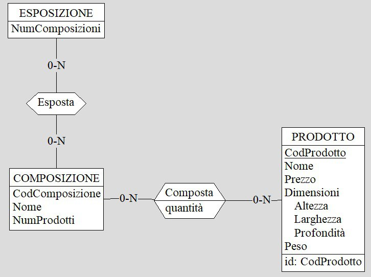
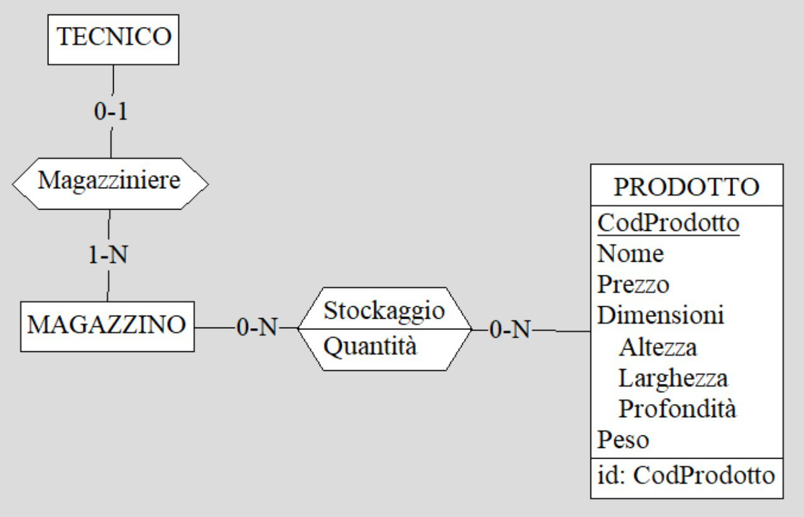

<h1 style="text-align: center">Elaborato per il corso</h1>
<h1 style="text-align: center">di basi di dati</h1>
<h3 style="text-align: center">2021/2022</h3>
  
<h1 style="text-align: center">MiKasa</h1>
  

### Componenti

Salvatore Antonio Addimando, matricola : 0000970539 
Benedetta Pacilli, matricola: 0000975296 
Valentina Pieri, matricola: 0000974789

# Indice

# Capitolo 1 - Analisi dei requisiti

## Intervista

Si vuole tenere traccia di una catena di negozi simil-Ikea.
Per ogni negozio si tiene traccia del luogo e della data di inaugurazione, dell'orario di apertura e del suo codice negozio.
Ogni negozio viene suddiviso in zone, ognuna con un suo codice zona. Vi sono 4 tipi di zone: shop alimentari, ristoro, esposizione e magazzino.
La zona delle esposizioni è formata da tante composizioni di mobili, come ad esempio: cucina, bagno, ufficio, camera da letto, ecc...
Per ogni composizione viene salvato il nome, il numero di prodotti al suo interno e il suo codice composizione.
Una composizione è formata da più prodotti e ogni prodotto appartiene ad una sola composizione. Per ogni prodotto vengono salvati: il nome, il prezzo, le dimensioni, il peso e il codice prodotto. Ci sono 3 tipi di prodotti: i mobili, gli accessori e gli elettrodomestici.
Ad ogni prodotto viene inoltre associato uno o più colori e ogni colore può essere di più prodotti. Per ogni colore vengono salvati il nome e il codice colore.
Per i prodotti si mantiene uno storico sconti: a ogni prodotto possono essere applicati più sconti in base al periodo dell'anno. Il periodo di validità di uno sconto viene mantenuto tramite lo storico sconti. Ogni sconto può essere applicato a più prodotti. Per lo sconto vengono salvati una percentuale conto e un codice sconto, mentre, per lo storico sconti vengono salvati il periodo di sconto e il codice dello storico.
Tutti i prodotti vengono stockati nei magazzini dei vari negozi. In ogni magazzino ci sono da zero a N prodotti e, allo stesso tempo, ogni prodotto può essere presente in uno, nessuno o tanti magazzini. Per lo stockaggio dei prodotti vengono salvati la locazione del prodotto nel magazzino e la quantità di prodotto presente.
Per quanto riguarda lo shop alimentari e la zona di ristoro, questi vendono diversi alimenti. La zona ristoro vende gli alimenti al dettaglio mentre, la zona dello shop li vende all'ingrosso. Per entrambe le vendite vengono mantenuti i prezzi, al pezzo da una parte e all'ingrosso dall'altra. Inoltre, nella vendita all'ingrosso viene mantenuto il numero di pezzi venduti per ogni prodotto. Per i vari alimenti vengono salvati: il nome, gli ingredienti con i relativi allergeni, la provenienza, la scadenza e il codice a barre.
In questo database vi sono anche diversi tipi di persone. Per ogni persona vengono salvati: il nome, il cognome, il numero di telefono, l'indirizzo email, l'indirizzo e il codice fiscale. Ci sono 3 tipi di persone: clienti, personale e acquirenti. Ogni acquirente può aprire diversi negozi della catena mentre, ogni negozio ha un solo acquirente.
Per il personale vengono salvati: il salario, l'orario lavorativo e il codice personale. Il personale si divide tra impiegati e manager.
Ogni manager si occupa di un solo negozio e ogni negozio ha un solo manager.
Ci sono diversi tipi di impiegati: i tecnici, i tecnici commerciali e gli amministratori. Ogni amministratore gestisce una sola zona di un negozio mentre, ogni zona può avere più amministratori.
Ogni tecnico commerciale può occuparsi: di uno o nessuno shop, di uno o nessun alimentari, di zero/N ordini. Per quanto riguarda l'alimentari e il ristoro, questi possono avere da 1 a N tecnici commerciali mentre, ogni ordine è gestito da un solo tecnico commerciale.
Gli ordini vengono effettuati dai clienti: ogni cliente può fare più ordini e ogni ordine è relativo ad un solo cliente. Il singolo ordine è formato da zero/N dettagli ordine per prodotto/composizione. Un dettaglio ordine tiene conto della quantità acquistata di ogni singolo/a prodotto/composizione ordinato/a. Oltre alla quantità, un dettaglio ordine mantiene il prezzo totale per quel/la prodotto/composizione. Per ogni ordine vengono mantenuti: la data di effettuazione, il costo totale, il peso totale, lo sconto totale dell'ordine, la data di arrivo e il codice ordine. Un cliente può essere socio o meno; in caso sia socio ha diritto ad uno sconto sull'ordine totale. Gli ordini si dividono in due categorie: con e senza spedizione. Di un ordine spedizione si può fare il ritiro in un solo negozio, in ogni negozio vengono spediti più ordini. Per la spedizione, di un ordine con spedizione, viene mantenuto l'indirizzo di spedizione e il codice spedizione. Ogni spedizione viene consegnata da uno o più tecnici e ogni tecnico si può occupare di zero/N spedizioni.
Per un ordine con spedizione si può richiedere il montaggio. L'assemblaggio viene gestito da uno o più tecnici e ogni tecnico può occuparsi di zero/N assemblaggi. Infine, un tecnico può lavorare o meno come magazziniere nel magazzino di un negozio, ogni magazzino ha uno o più tecnici che vi lavorano.

## Estrazione dei concetti principali

| Termine | Descrizione |
| ------- | ----------- |
| Negozio | Un negozio della catena
| Zona | Ogni negozio viene diviso in zone
| Acquirente | Colui che acquista e apre un negozio
| Cliente | Colui che effettua acquisti in un negozio creando ordini
| Manager | Colui che gestisce un negozio
| Amministratore | Colui che si occupa di una zona di un negozio |
| Tecnico commerciale | Colui che gestisce o la zona ristoro o lo shop alimentari (di un determinato negozio) o gli ordini
| Tecnico | Colui che si occupa o del magazzino di un negozio o delle spedizioni o degli assemblaggi
| Shop alimentari | La zona di un negozio dove vengono venduti gli alimenti all'ingrosso
| Ristoro | La zona di un negozio dove vengono venduti gli alimenti al dettaglio | Punto ristoro
| Alimento | Venduto in ogni shop alimentari e in ogni punto ristoro
| Magazzino | La zona di un negozio dove vengono stoccati i prodotti
| Esposizione | La zona di un negozio in cui vi sono le varie composizione
| Composizione | Una composizione è formata da tanti prodotti. Ogni composizione mostra in modo visivamente gradevole un insieme di prodotti relativi ad una determinata zona della casa (bagno, camera da letto, cucina, ...). Ogni composizione può essere interamente acquistata da un cliente
| Prodotto | Venduto da ogni negozio, può essere acquistato dal cliente. Ogni prodotto può essere diversamente scontato in base al periodo dell'anno
| Ordine | Ogni ordine viene effettuato da un cliente. L'ordine è formato da tanti dettagli ordine, specifici o per un prodotto o per una composizione. In caso il cliente che effettua l'ordine, sia socio, viene applicato uno sconto totale sull'ordine. Ogni ordine può essere richiesto con o senza spedizione: un ordine senza spedizione verrà spedito ad un negozio scelto dal cliente mentre, un ordine con spedizione viene spedito all'indirizzo del cliente. Inoltre, per ogni ordine con spedizione può essere richiesto o meno il montaggio

Non sono stati individuati sinonimi.

# Capitolo 2 - Progettazione concettuale

## Schema scheletro 

Per lo sviluppo dello schema ER generale si procede suddividendolo in  schemi ER più piccoli che modellano i singoli concetti di MiKasa.

### Persona

Per modellare i vari ruoli presenti nel database si parte da un'entità padre: **Persona**. Persona racchiude tutti i campi necessari al modellamento di **Cliente**, **Acquirente** e **Personale**. L'entità Personale modella un generico membro del corpo lavorativo di MiKasa e si divide in **Impiegato** e **Manager**. Infine, l'entità Impiegato è stata divisa nelle tre categorie; **Tecnico**, **Tecnico Commerciale** e **Amministratore**.
La gerarchia Persona-Cliente-Personale-Acquirente è totale ma non esclusiva; è infatti possibile, ad esempio, che una stessa persona possa sia essere un cliente che un membro del personale. Entrambi le gerarchie Personale-Impiegato-Manager e Impiegato-Tecnico-Tecnico Commerciale-Amministratore sono sia totale che esclusive.

### Cliente-Ordine

Una relazione fontamentale è quella del **Cliente** che effettua un **Ordine**. 
Ogni cliente può effettuare tutti gli ordini che vuole. Per ogni ordine è fondamentale calcolare il suo peso e costo totale, ottenuti dai dati dei singoli prodotti acquistati. Per il prezzo totale è importante controllare che il cliente sia socio o meno, da socio infatti si ha diritto ha uno sconto sul prezzo totale dell'ordine.
Il cliente può anche scegliere se far spedire l'ordine al suo indirizzo o ad un negozio MiKasa dove si recherà il cliente stesso per ritirarlo. In caso di ordine con spedizione si hanno due ulteriori scelte: ordine senza montaggio e ordine con montaggio, in quest'ultimo l'assemblaggio dei mobili viene eseguito da un tecnico del personale.

### Personale-Ordine

L'altra importante relazione in cui c'è **Ordine** è quella tra gli ordini e il **Personale**.  
I tecnici commerciali gestiscono gli ordini: mettono insieme i vari articoli ordinati, stabiliscono la data di arrivo, gestiscono i soldi in entrata. Invece, di spedizione e montaggio se ne occupano i tecnici. 

### Negozio-Zona

Ogni **Negozio** della catena viene aperto da un **Acquirente** e gestito da un **Manager**. 
Ogni negozio è suddiviso in 4 zone: **Shop alimentari**, **Ristoro**, **Esposizione** e **Magazzino**.
 
 ### Orario
 
 
 
 L'entità **orario** viene utilizzata per definire l'orario lavorativo dei memebri del personale e l'orario di apertura dei negozi. Ogni orario che viene creato può essere usato da più membri del personale/negozi.
 
### Alimentari-Ristoro

 Sia nella zona **alimentari** che nella zona **ristoro** vengono venduti degli **alimenti**, nel primo si vendono in confezioni contenenti diverse unità di quell'alimento, nel secondo, essendo una zona bar/bistrot, ogni alimento è venduto singolarmente. 
 
 ###  Prodotto-Composizione
 
 
 
 La zona **esposizioni** di ogni negozio è formata da tante **composizioni** di mobili. Questa zona è pensata per mostrare al cliente, non solo ogni singolo prodotto venduto (in quanto non ci sono prodotti non esposti), ma anche per creare composizioni che siano esteticamente belle e funzionali. Tra le composizioni proposte ci sono infatti diverse proposte di cucina, salotto, bagno, ufficio, camera da letto, ecc ...
 
 ### Prodotto-Magazzino
 
  
  
  In ogni **Negozio** vi è un **Magazzino**; quest'ultimo può contenere o meno tutti i prodotti oppure essere addirittura vuoto.  Ogni **Prodotto** venduto nei negozi della catena infatti, si potrebbe trovare in ogni magazzino, in solo alcuni magazzini (quindi è presente in solo alcuni negozi) o anche in nessuno magazzino se la sua disponibilità è terminata ovunque. 
  In ogni magazzino ci lavorano alcuni tecnici detti magazzinieri.
 
 ### Prodotto
 
 
 
 I **prodotti** venduti in ogni negozio sono divisi in tre categorie (mobili, accessori, elettrodomestici) tramite una gerarchia totale ed esclusiva. 
 Ogni prodotto può avere uno o più **colori** e può essere scontato o meno.
 Il sistema degli **sconti** viene gestito mediante uno **storico sconti** che, per ogni sconto, mantiene il suo periodo di validità annuale.
 Ogni prodotto può avere uno, nessuno o molti sconti; in quanto questi hanno tutti diversi periodi di validità
  
   ### Dettaglio Ordine
  

Ogni **Ordine** è formato da più dettagli ordine. Ci sono due tipi di dettaglio ordine: **Dettaglio Ordine per Prodotto** e **Dettaglio Ordine per Composizione**.  
Ogni dettaglio ordine per prodotto mantiene i dati per un solo prodotto acquistato: quanti pezzi sono stati acquistati di quel prodotto e il costo totale per quel prodotto (ottenuto moltiplicando il prezzo, già scontato se ha uno sconto applicato valido nel periodo di effettuazione dell'ordine, del singolo prodotto per la quantità).
Lo stesso meccanismo vale per il dettaglio prodotto per composizione.

## Schema concettuale finale

# Capitolo 3 - Progettazione logica

## Stima del volume dei dati

| Concetto | Costrutto | Volume|
| ----------- | ----------- | ----------- |
| Persona | E | 20,002,200
| Cliente | E | 20,000,000
| Personale | E | 2,100
| Acquirente | E | 100
| Impiegato | E | 2,000
| Manager | E | 100
| Tecnico | E | 2,000
| Amministratore | E | 2,000
| Tecnico Commerciale | E | 2,000
| Negozio | E | 100
| Orario | E | 2,300
| Zona | E | 400
| Alimentari | E | 100
| Ristoro | E | 100
| Esposizione | E | 100
| Magazzino | E | 100
| Alimento | E | 10,000
| Prodotto | E | 1000
| Mobile | E | 400
| Elettrodomestico | E | 400
| Accessorio | E | 200
| Colore | E | 10
| Sconto | E | 10
| Storico sconti | E | 10
| Composizione | E | 10
| Dettaglio Ordine per Prodotto | E | 50,000,000,000
| Dettaglio Ordine per Composizione | E | 50,000,000,000
| Ordine | E | 1,000,000,000
| Ordine senza Spedizione | E | 500,000,000
| Ordine con Spedizione | E | 500,000,000
| Ordine senza Montaggio | E | 250,000,000
| Ordine con Montaggio | E | 250,000,000
| Effettua | R | 1,000,000,000
| Ritiro | R | 500,000,000
| Consegna | R | 500,000,000
| Montaggio | R | 250,000,000
| Dettaglio Prodotto | R | 50,000,000,000
| Dettaglio Composizione | R | 50,000,000,000
| Riferimento Prodotto | R | 50,000,000,000
| Riferimento Composizione | R | 50,000,000,000
| Gestione | R | 1,000,000,000
| Orario Lavorativo | R | 2,100
| Orario Apertura | R | 100
| Apertura | R | 100
| Management | R | 100
| Amministra | R | 400
| Suddivisione | R | 400
| Cassiere | R | 100
| Ristorazione | R | 100
| Magazziniere | R | 100
| Esposizione | R | 100
| Confezione | R | 100,000
| Porzione | R | 100,000
| Esposta | R | 10,000
| Composta | R | 100,000
| Colorazione | R | 100,000
| Applicato | R | 1,000
| Storico | R | 10

## Descrizione delle operazioni principali e stima della loro frequenza

| Codice | Operazione | Frequenza |
| ----------- | ----------- | ----------- |
| 1 | Aggiungere un nuovo cliente | 1 a settimana
| 2 | Iscrizione di un cliente per divenire socio | 10 al mese
| 3 | Aggiungere un nuovo membro del personale | 10 all'anno
| 4 | Aggiungere un nuovo negozio alla catena | 1 ogni due anni
| 5 | Effettuazione di un ordine da parte di un cliente | 1 all'anno
| 6 | Aggiungere un nuovo prodotto | 2 all'anno
| 7 | Aggiungere un nuovo alimento | 1 all'anno
| 8 | Aggiungere una nuova composizione |1 all'anno
| 9 | Aggiungere un nuovo sconto | 1 all'anno
| 10 | Leggere tutti gli ordini effettuati | 1 al mese
| 11 | Leggere tutti gli ordini effettuati da un cliente | 1 al mese
| 12 | Leggere tutti le spedizioni effettuate | 2 all'anno
| 13 | Leggere tutti i ritiri effettuati | 2 all'anno
| 14 | Leggere tutti i montaggi effettuati | 2 all'anno
| 15 | Leggere il prodotto più acquistato | 2 all'anno
| 16 | Leggere il prodotto meno acquistato | 2 all'anno
| 17 | Leggere il prodotto più costoso | 1 all'anno
| 18 | Leggere il prodotto meno costoso | 1 all'anno
| 19 | Leggere l'alimento più costoso porzionato | 1 all'anno
| 20 | Leggere l'alimento più costoso  confezionato | 1 all'anno
| 21 | Leggere la quantità presente(in ogni magazzino) di un determinato prodotto | 1 a settimana
| 22 | Leggere tutti i prodotti terminati nei vari magazzini | 1 al giorno
| 23 | Leggere tutti i membri del personale | 1 al mese
| 24 | Leggere i prodotti con lo sconto maggiore | 2 all'anno
| 25 | Leggere i membri del personale aggiunti dopo una certa data | 1 all'anno
| 26 | Leggere i clienti aggiunti dopo una certa data | 1 all'anno
| 27 | Leggere i clienti divenuti soci dopo una certa data | 1 all'anno
| 28 | Leggere tutti i clienti | 2 all'anno
| 29 | Leggere tutti i soci | 2 all'anno
| 30 | Leggere tutti gli ordini effettuati dopo una certa data | 1 all'anno
| 31 | Leggere l'ordine più costosto mai effettuato | 1 all'anno
| 32 | Leggere l'ordine più costoso effettuato da ogni cliente | 1 all'anno